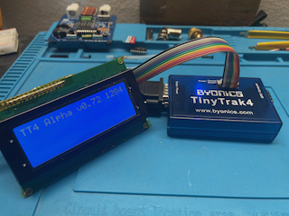
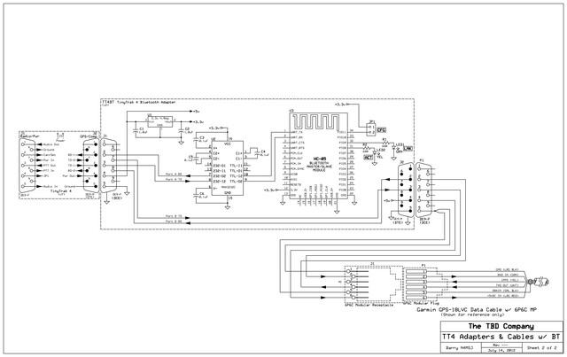
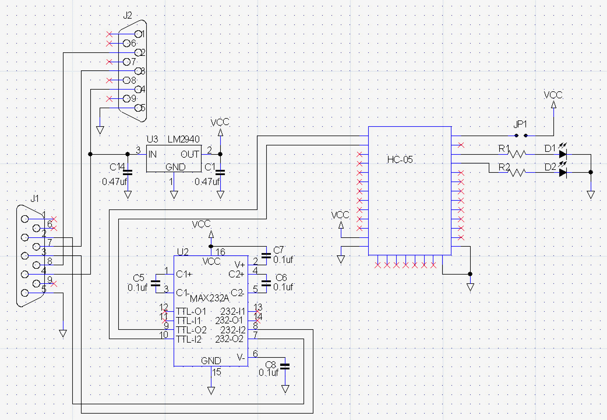

# TT4 - MODS
The tiny track4 is older unit, but still could use a mod page!

The hardest part of adding an LCD to this unit is cutting the case and obtaining the PCB. Byonics was kind enough to supply the PCB minimaly populated which makes this process very quick to adapt!

Bluetooth Module
- 
- 

Also see:
- TNC [Commands](Commands.md)
- [Micro-TrakRTGFA](https://github.com/SpudGunMan/Micro-TrakRTGFA-mods)
- [MicroTrak-MTT4B](https://github.com/SpudGunMan/MicroTrak-MTT4B-mods)
